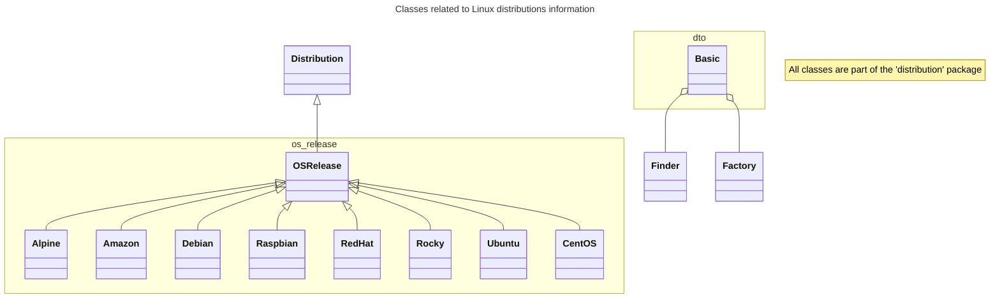

# py-linux-info

API in Python to recover information about a running Linux OS.

## How to use it

## Development

### Classes

## Related projects

This project is a convertion of the
[Linux-Info](https://github.com/glasswalk3r/Linux-Info) project to Python.

Although interface might be different, the features will probably be the same.

## Copyright and license

This software is copyright (c) 2024 of Alceu Rodrigues de Freitas Junior,
glasswalk3r@yahoo.com.br

This file is part of Linux Info project.

Linux Info is free software: you can redistribute it and/or modify it under the
terms of the GNU General Public License as published by the Free Software
Foundation, either version 3 of the License, or (at your option) any later
version.

Linux Info is distributed in the hope that it will be useful, but WITHOUT ANY
WARRANTY; without even the implied warranty of MERCHANTABILITY or FITNESS FOR
A PARTICULAR PURPOSE. See the GNU General Public License for more details.

You should have received a copy of the GNU General Public License along with
Linux Info. If not, see (http://www.gnu.org/licenses/).
